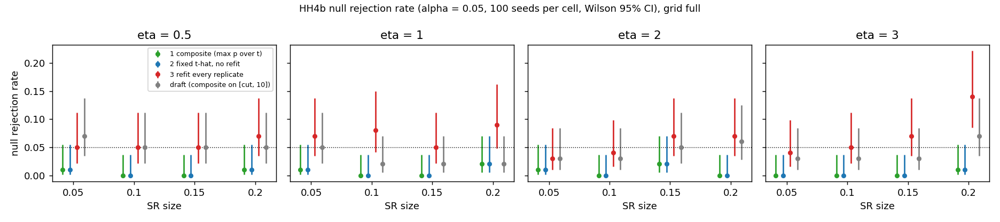
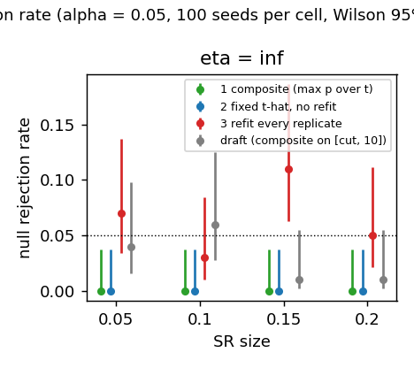
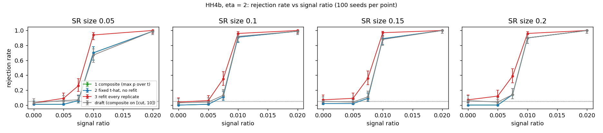
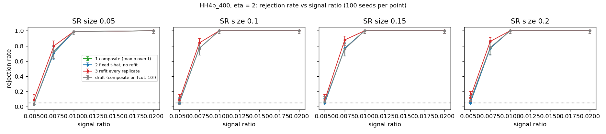
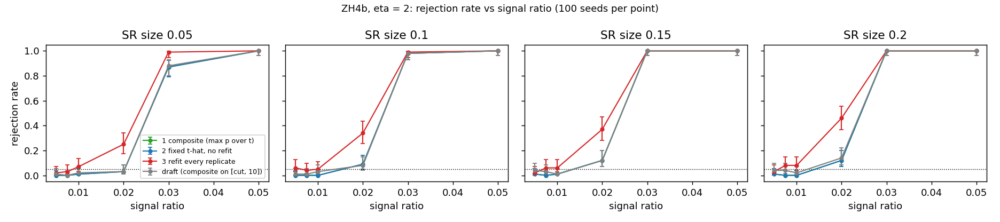
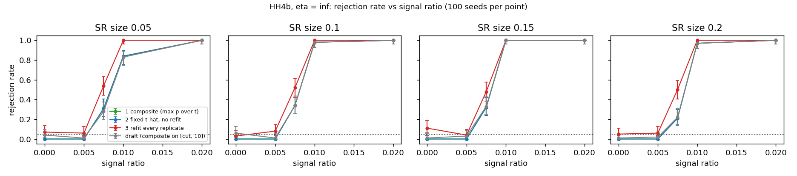
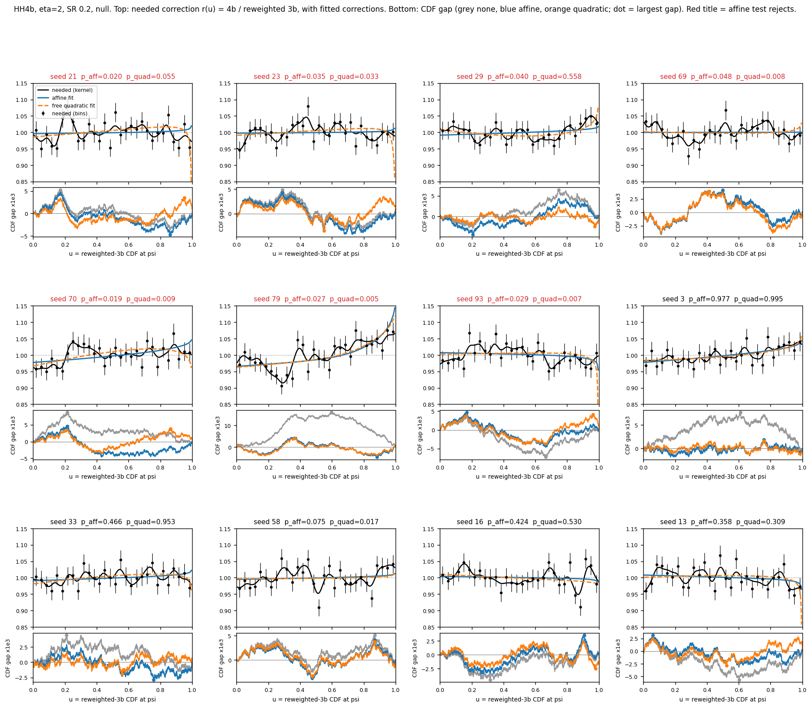
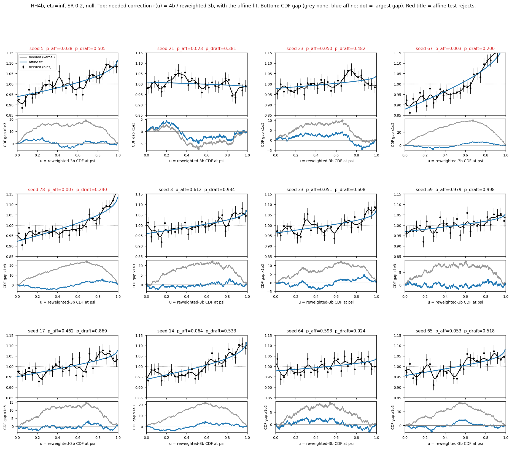
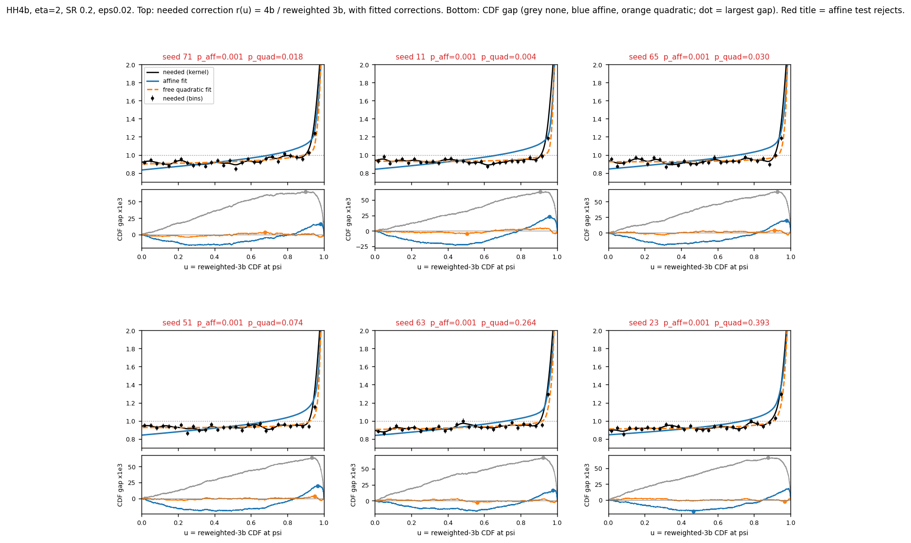

# Three affine-correction KS tests on all paper configs

Date: 2026-10-06. Networks: the original (pre-campaign) `TrainingInfo` networks used by the draft. Related: #1 (centered Poisson(1) multiplier bootstrap), #14 (reweighted-CDF residuals).

## Summary

- We compare three tests on the same correction family, the same configs and the same bootstrap multipliers: (1) the composite-null test of the draft, (2) a fixed-correction test, (3) a refit test.
- **Tests 1 and 2 give the same p-value in all 14,000 configs.** The largest composite p-value is always at the fitted slope, so the composite test reduces to the fixed-correction test.
- **Tests 1 and 2 are very conservative:** pooled null rejection rate 0.6% (9/1,600) for eta = 0.5 to 3, and 0/400 at eta = infinity. Their power is about the same as the current draft.
- **Test 3 is close to nominal overall (6.4%) but liberal at SR size 0.2** (7 to 14 per 100). It has the most power (higher than tests 1 and 2 by 5 points or more in 58 of 104 power cells), but part of that gain comes from its higher size.
- A decision is needed: tests 1 = 2 (conservative, simple, exact justification) or test 3 (more power, about 6% size).

## Setup

- **Grids.** All 12,000 configs of `continuous_affine_full_v1` (the draft's power figures and supplementary noise table: HH4b at eta = 0.5, 1, 2, 3; HH4b_400 and ZH4b at eta = 2; SR size 0.05 to 0.2; 100 seeds per cell). Also the 2,000 configs of `continuous_affine_eta_inf_v1` (eta = infinity, internal only).
- **Scores.** Clipped to [SR cut, 10] by the draft loaders. The upper clip at 10 is a sanity guard only.
- **Correction family.** Affine correction of the reweighted 3b weights, required to be nonnegative on the **observed 3b range [min 3b score, max 3b score]** (the draft used [SR cut, 10]). The corrected normalized 3b CDF is F_minus + t (F_plus - F_minus), t in [0, 1]. Every 3b event keeps a nonnegative weight. 4b weights may be signed (ZH4b signal samples) with a positive total, as in the draft.
- **Bootstrap.** Centered Poisson(1) multipliers, B = 1000, independent 3b and 4b streams from `SeedSequence(1729).spawn(2)`, shared by all three tests. alpha = 0.05.

## The three tests

Let D(t) = sup_y |B(y) + t d(y)| be the observed KS gap at slope t, where d = F_plus - F_minus. Let G_b be the centered multiplier process of replicate b.

1. **Composite (draft method).** For each fixed t, p(t) compares D(t) with Q_b(t) = sup|G_b(t)| (no fit). p = max over t in [0, 1] of p(t) (Berger and Boos, JASA 1994). Computed exactly with the draft's envelope code.
2. **Fixed correction.** t_hat = argmin_t D(t), statistic T = D(t_hat). The bootstrap statistic is sup|G_b(t_hat)| with no refit.
3. **Refit.** Same T. Each replicate is recentred at the fitted null and refitted: T*_b = min_t sup|G_b(t) + (t - t_hat) d|.

## Checks

- Test 1 reproduces the draft's stored p-values exactly in 10 of 10 configs (2 of them signed-4b ZH4b) when it uses the draft's range [cut, 10], the draft's event order and the draft's multiplier stream (`check_composite_vs_draft.py`).
- Test 3 equals the earlier refit run (`centered_poisson_obsrange_linf_refit_full_v1`, `..._eta_inf_v1`) in 14,000 of 14,000 configs.
- Fits at the edge t = 0: 359 of 12,000 (full grid), 0 of 2,000 (eta = infinity).

## Null rejections (HH4b, per 100 seeds)

| eta | Tests 1 = 2 (SR .05 / .10 / .15 / .20) | Test 3 refit | Draft ([cut, 10]) |
|---|---|---|---|
| 0.5 | 1 / 0 / 0 / 1 | 5 / 5 / 5 / 7 | 7 / 5 / 5 / 5 |
| 1 | 1 / 0 / 0 / 2 | 7 / 8 / 5 / 9 | 5 / 2 / 2 / 2 |
| 2 | 1 / 0 / 2 / 0 | 3 / 4 / 7 / 7 | 3 / 3 / 5 / 6 |
| 3 | 0 / 0 / 0 / 1 | 4 / 5 / 7 / **14** | 3 / 3 / 3 / 7 |
| **Pooled (1,600)** | **0.6%** (CI 0.3 to 1.1) | **6.4%** (CI 5.3 to 7.7) | **4.1%** (CI 3.3 to 5.2) |
| infinity (internal) | 0 / 0 / 0 / 0 (0.0%) | 7 / 3 / 11 / 5 (6.5%) | 4 / 6 / 1 / 1 (3.0%) |

Null rejection rate by where the fitted slope lands (eta = 0.5 to 3): interior fits: tests 1 = 2 0.1%, test 3 5.7%, draft 1.6%. Edge fits (t = 0): tests 1 = 2 6.9%, test 3 15.5%, draft 36.2%.

## Power (mean over the four SR sizes)

| Experiment | eta | signal | Tests 1 = 2 | Test 3 refit | Draft |
|---|---|---|---|---|---|
| HH4b | 2 | 0.005 | 0.010 | 0.090 | 0.045 |
| HH4b | 2 | 0.0075 | 0.100 | **0.340** | 0.113 |
| HH4b | 2 | 0.01 | 0.850 | **0.958** | 0.843 |
| HH4b | 2 | 0.02 | 0.995 | 1.000 | 0.995 |
| HH4b_400 | 2 | 0.0075 | 0.755 | **0.845** | 0.760 |
| HH4b_400 | 2 | 0.01 | 0.998 | 0.998 | 0.998 |
| ZH4b | 2 | 0.02 | 0.090 | **0.355** | 0.092 |
| ZH4b | 2 | 0.03 | 0.963 | 0.995 | 0.965 |
| ZH4b | 2 | 0.05 | 1.000 | 1.000 | 1.000 |
| HH4b | 0.5 | 0.01 | 0.475 | **0.722** | 0.473 |
| HH4b | 1 | 0.01 | 0.682 | **0.865** | 0.688 |
| HH4b | 3 | 0.01 | 0.932 | **0.998** | 0.925 |
| HH4b | infinity | 0.0075 | 0.295 | **0.510** | 0.293 |

Per-cell values with Wilson 95% intervals: `data/summary_full.csv`, `data/summary_eta_inf.csv`.

- Tests 1 = 2 against the draft: lower by 5 points or more in 4 of 104 power cells, higher in none.
- Test 3 against tests 1 = 2: higher by 5 points or more in 58 of 104, lower in none. **Not size-matched** (6.4% against 0.6%).

## Why tests 1 and 2 agree, and why they are conservative

Under the null at the true slope t0, B + t0 d is sampling noise e (size about 1/sqrt(n), about 0.003), so D(t) = sup|e + (t - t0) d|. The direction d is large (about 0.1).

- **The fit removes part of the noise.** t_hat moves t to cancel the part of e along d, so T = D(t_hat) is smaller than the full noise sup|e|.
- **The composite maximum is at t_hat.** Away from t_hat, D(t) increases by about |t - t_hat| x 0.1, while Q_b(t) changes by at most |t - t_hat| x 0.003. So p(t) is largest at t_hat, and the composite p equals p(t_hat), which is test 2.
- **So both compare a fitted statistic with an unfitted bootstrap.** T has the d-part of the noise removed. Q_b(t_hat) does not. T is usually small against the Q_b, and the test is conservative (0.1% null on interior fits).
- **The composite test is still valid** (Berger and Boos): p(t0) is calibrated at the true t0, and max_t p(t) >= p(t0). It does not use the size that the fit gains.
- **The refit test matches the two sides.** Its T*_b also has the d-part removed, so its interior null rate is 5.7%.
- **Why the draft was less conservative (4.1%).** On [cut, 10], 28% of null fits were at the edge t = 0, where the fit cannot cancel the d-part of the noise. Those configs over-rejected (36%). The conservative interior and the liberal edge averaged to about 4%.

## Why test 3 is liberal at SR size 0.2

Null rejections of test 3 increase with SR size: 4.8%, 5.5%, 6.0%, 9.2% for SR 0.05 to 0.2 (eta = 0.5 to 3). There is no trend in eta.

The needed correction r(u) = (4b density) / (reweighted 3b density) against u = reweighted-3b CDF at the score:

- **eta = 2, null:** r is about 1 with local wiggles of 3 to 5% over about 0.1 of u. Rejected and non-rejected seeds look similar. No smooth correction (affine or quadratic) can follow local wiggles.
- **eta = infinity, null:** r has a large smooth tilt (about 0.92 to 1.10) that the affine correction removes. The residual after correction (about 3 to 5 x 10^-3) has the same size and type as at eta = 2.
- **eta = 2, signal 0.02:** r is flat at about 0.93 with a sharp spike in the top 5% of u. The affine correction cannot follow a spike, so the test rejects.

Working explanation (not proven): the residual wiggles come from the estimation error of the CR-trained network. The test conditions on the learned weights, and the bootstrap reproduces only the sampling noise of SR events. A larger SR has less sampling noise, so the same network error becomes visible. A direct check: compare the spread between the 5 CR ensemble members with the size of the wiggles.

## Related experiments (same day, SR 0.2 null unless stated)

- **[cut, 10] against the observed range.** With nonnegativity on [cut, 10], every edge fit was at t = 0 (the U = 10 cap limits steep decreases). The observed range [min, max] reduced edge fits from 221 to 43 of 800 in the null pilot.
- **L1 against L-infinity fit for test 3.** Both gave similar results. L-infinity was selected (worst null cell 9/100 in the pilot, against 10/100 for L1).
- **Quadratic correction (nonnegative).** Null 6.8% at SR 0.2, with 43% edge fits.
- **Free quadratic (sign not constrained), diagnostic only.** Null 5.0% at SR 0.2, but it **loses most power** (for example HH4b eta 2, signal 0.01: 0.26 against 0.96 for test 3). On the u axis, a quadratic in the score is a "hockey stick" that copies the signal spike. A correction family must stay smooth and must not bend sharply in the top tail.
- **Affine without the sign constraint, diagnostic only.** Edge configs improved (6/15 to 2/15 rejected), but the pooled rate stayed at 9.2%, because the excess comes from interior fits. Negative weights affected 1 to 5 of about 62,000 3b events per config.

## Files

- On wright: `~/SRFinder/soheun/data/refit_bootstrap/three_tests_obsrange_v1/{full,eta_inf}/` (`results/*.pkl`, `detailed.csv`, `summary.csv`, figures) and `scripts/`.
- In this branch: `scripts/` (runner, aggregator, check, plots), `data/` (summaries), `figures/`.

## Decision needed

- **Tests 1 = 2:** null 0.6% (never above 2/100 in any cell), power about equal to the current draft, exact justification, simple procedure (fit t_hat, bootstrap at t_hat).
- **Test 3:** null 6.4% (liberal at SR 0.2, up to 14/100), the most power.
- A possible middle option ("sweet spot") is under study.
