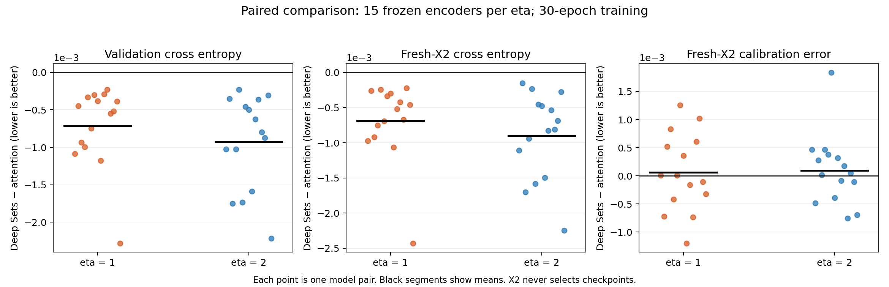
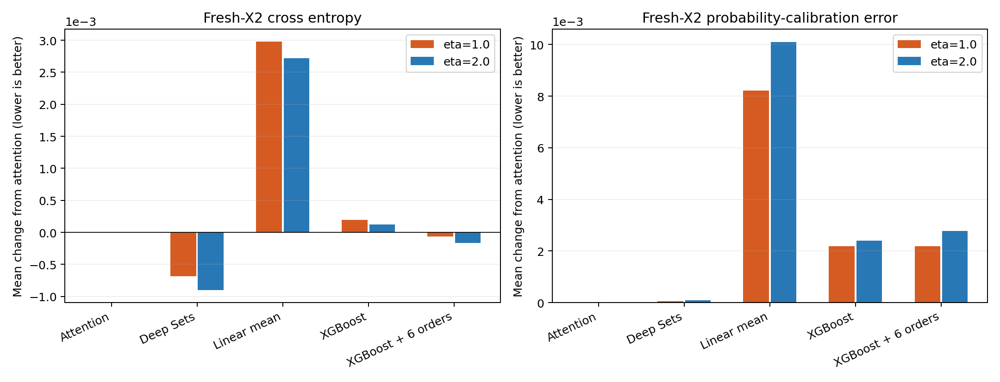
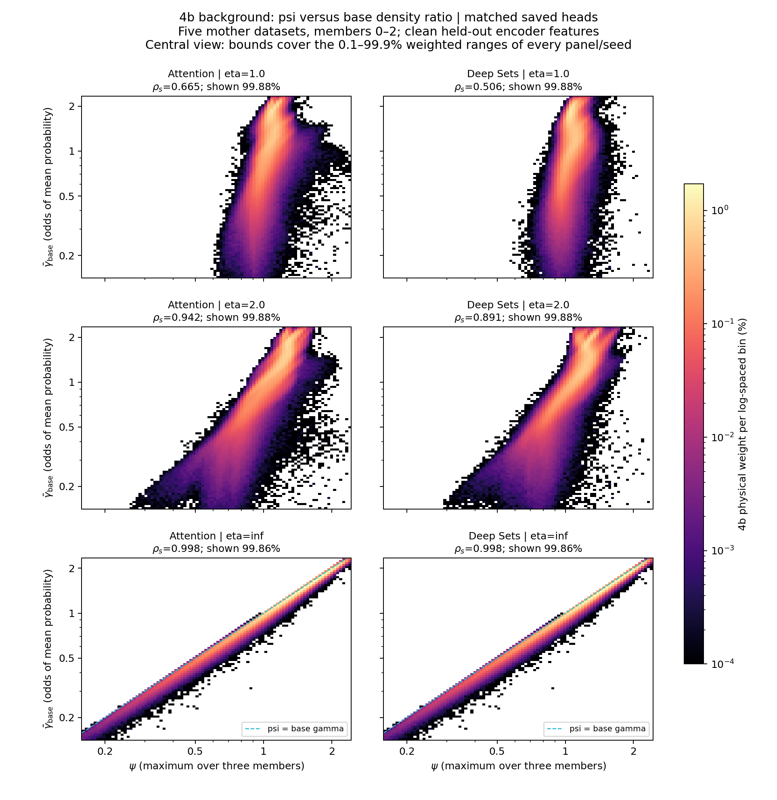
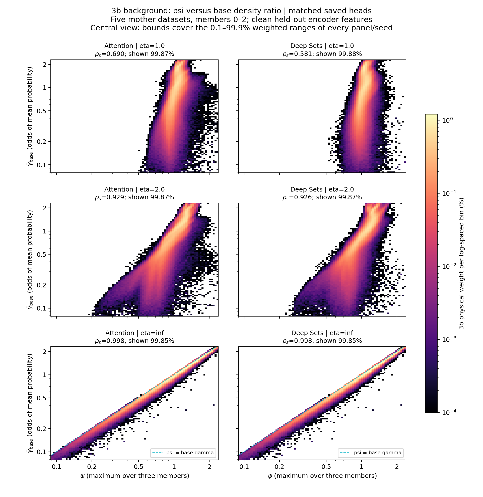
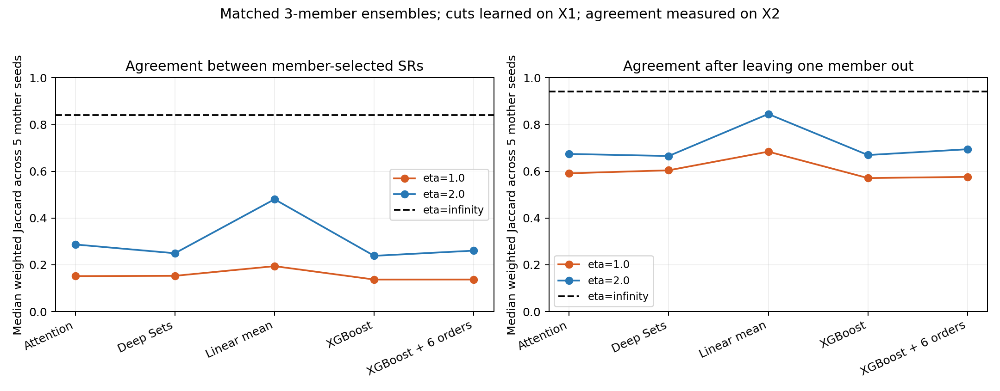

## Step 2 architecture follow-up: evidence supporting a switch to Deep Sets

**Recommendation:** use the tested Deep Sets head as the preferred Step 2 candidate for the next controlled pipeline comparison. Its strongest support is consistently lower held-out classification loss while retaining pairing symmetry. Clean-feature diagnostics additionally show less base-aligned variation in the resulting selection score.

**Status:** the Deep Sets pilot is implemented and evaluated, but the production campaign still uses Attention. No Deep Sets Step 3 model or end-to-end calibration/power comparison has been run. The user asked to think through the architecture before submitting new eta=0.5 training; that submission remains on hold. This comment records the rationale and remaining checks, not a launch authorization or a claim that the campaign has already migrated.

This concerns the **smeared ratio learner only**. Step 1 base classifiers/encoders can be reused. The recorded `mean_probability` aggregation decision remains unchanged ([decision v2](https://github.com/soheunyi/SRFinder/issues/11#issuecomment-5975002900)). The existing background-bias diagnostics are tracked separately in #14.

### 1. Why this architecture is a credible candidate

The current Attention head computes one attention-weighted average of the three raw six-dimensional pairing representations, then classifies that six-dimensional summary. Deep Sets learns a richer shared representation **before** pooling:

`shared training-only normalization -> phi(6,64,64) -> mean over the three pairings -> rho(64,64,2)`, with SiLU activations.

The pairing feature map is equivariant and the event prediction is invariant under permutation of the three pairings. This retains the symmetry already present in Attention while allowing nonlinear features of the set to survive pooling. [Zaheer et al., Deep Sets (NeurIPS 2017)](https://proceedings.neurips.cc/paper/2017/hash/f22e4747da1aa27e363d86d40ff442fe-Abstract.html) supplies the architectural basis; the performance claims below are from this project's pilot.

The concrete implementations have **696 parameters (Attention) versus 8,898 (Deep Sets)**. Capacity and fixed input normalization also changed. This comparison supports the tested implementation; it does not isolate architecture from parameter count or establish superiority over every possible wider Attention head.

### 2. Matched loss comparison

Scope: HH4b null, mother seeds 0–4, frozen encoder/member seeds 0–2, eta 1 and 2: **30 model pairs sharing five mother datasets**. Both heads use identical smeared inputs, physical weights, train/validation splits, Adam/scheduler/batch schedule and 30-epoch cap. X1 validation chooses checkpoints. Evaluation uses the same 150,000 X2 events per mother with two fresh noise draws; X2 never selects a checkpoint or boosting round.

Deep Sets has lower X1 validation loss and fresh-noise X2 loss in **30/30 paired comparisons**. Mean weighted fresh-X2 cross entropy:

| eta | Attention | Deep Sets | Deep Sets minus Attention |
|---|---:|---:|---:|
| 1 | 0.6650524 | 0.6643680 | -0.0006844 |
| 2 | 0.6742472 | 0.6733459 | -0.0009013 |

Deep Sets also beats the tested linear pairing-mean model, XGBoost configuration, and six-permutation probability-averaged XGBoost on fresh-X2 loss in all 30 model comparisons. This was a fixed baseline configuration, not an exhaustive tree-model search or matched-compute comparison.

Simple-baseline comparison

### 3. Operational-score heatmaps on clean encoder features

The loss checks above use freshly **smeared** features. Actual selection queries the denominator on **clean** encoder features, so we separately examined that operational score using the saved heads.

For each architecture, the matched three-member score is

`log psi = max_m(log gamma_base,m - log gamma_smeared,m)`.

The base reference is `odds(mean_m probability_base,m)` for members 0–2. Both heads use the same base networks and held-out X2 events. Heatmaps separate physical-weighted 4b and 3b; normalize within each mother/class and then average the five histograms. Correlations are calculated on all events **within each mother first**, then summarized across mothers. Zoomed figures display at least 99.5% of the mass; full-range figures are in the linked gallery.

Median weighted Spearman correlations between psi and mean-probability base gamma:

| eta | 4b: Attention | 4b: Deep Sets | 3b: Attention | 3b: Deep Sets |
|---|---:|---:|---:|---:|
| 1 | 0.6654 | 0.5057 | 0.6899 | 0.5811 |
| 2 | 0.9418 | 0.8909 | 0.9291 | 0.9260 |
| infinity | 0.9979 | 0.9979 | 0.9981 | 0.9981 |

Deep Sets reduces the 4b correlation in 4/5 mothers at eta 1 and 5/5 at eta 2; the 3b correlation decreases in all five at both eta values. Infinity panels are identical by construction because the smeared head is absent. Their correlation is slightly below one because psi uses a maximum and the base reference uses mean probability.

Corresponding 3b heatmaps

### 4. What the cancellation interpretation does and does not establish

At member level, `log psi = b - s`, where `b` is the base log ratio and `s` is the smeared log ratio. If the denominator captures more structure shared with the base estimate, more of that structure can cancel. We checked whether weaker correlation could be explained solely by adding independent noise to an otherwise unchanged score.

For each mother, fit the weighted projection `log psi = intercept + slope * log base_gamma_mean + residual`. Median paired Deep-Sets/Attention ratios on 4b:

| eta | SD of log psi | Base-projection slope | Projection-residual SD |
|---|---:|---:|---:|
| 1 | 0.859 | 0.627 | 0.965 |
| 2 | 0.910 | 0.876 | 1.165 |

Both total log-score variability and the base-projection slope decrease in every mother at both eta values. This supports attenuation of base-related variation and is inconsistent with a pure added-independent-noise explanation.

However, the projection-residual SD **increases about 16% at eta 2**. That residual contains nonlinear structure and possible estimation error; it is not a noise estimate. Also, the ensemble maximum and mean-probability reference do not isolate a single member's denominator. These results are consistent with stronger background cancellation, but do not prove more accurate true-ratio cancellation, better SR background closure, or preserved signal sensitivity.

### 5. Counterevidence and limits that should remain visible

- **Probability-bin calibration does not improve consistently.** Mean ten-bin ECE is slightly higher for Deep Sets: 0.0037313 versus 0.0036678 at eta 1, and 0.0037778 versus 0.0036795 at eta 2. Individual directions are mixed; this small bin-dependent difference does not establish an overall density-ratio ranking.
- **SR membership stability is not improved.** Median within-mother weighted member Jaccard is 0.1528 versus 0.1516 at eta 1, and 0.2494 versus 0.2869 at eta 2. Deep Sets exceeds Attention in only one of five paired mothers at each eta. Stability alone should not choose the model either.
- **This is a three-member, five-mother development pilot.** It is not the full 15-member, 100-mother campaign, and member pairs are not independent data replications.
- **No downstream improvement has yet been established.** A smaller classification loss or weaker correlation with base gamma does not by itself validate the SR background model or the hypothesis test.

SR agreement, including the simple baselines

### 6. What a switch requires

1. Preserve the existing Attention artifacts and Step 1 base models. Version the new Step 2 architecture, weights and model identities explicitly.
2. Export Deep Sets scores and define new X1 thresholds and X2 regions. Replacing the head changes psi and the selected events.
3. **Refit Step 3 for those new regions.** The existing CR-trained models belong to the old regions and cannot simply be relabeled. For the small matched comparison, both architectures should use the same selection-member count and matched CR-fitting settings.
4. Compare held-out CR and SR yield/CDF closure, followed by the agreed null-calibration and signal-sensitivity checks. Keep the final hypothesis test in SR. Then finalize the architecture and campaign launch scope.

The existing saved Deep Sets pilot can support this next controlled Step 3 comparison without first rerunning the entire Step 2 campaign. Full-campaign migration and new eta=0.5 training have not been launched by this follow-up.

### Validation and provenance

Input fingerprints and saved checkpoint hashes verify. Pairing permutation tests preserve the mathematical invariance/equivariance; trained CPU-double output differences were at roundoff (maximum 2.22e-16), while GPU float32/TF32 permutation differences were at most 8.27e-5. The repeated sequential/five-worker pilot case selected identical weights and losses. Cached prediction arrays remain float32.

For the heatmaps, original Attention predictions replay within 2e-4 in log odds and prior paired SR-overlap measurements reproduce within 2e-4. Infinity arrays and histograms match exactly between architectures. Full-range histograms retain all mass.

Relevant completed jobs: 214488 (Deep Sets pilot), 214490 (trained symmetry), 214492 (paired SR comparison), 214496–214497 (baselines), 214533 (clean-feature heatmaps), 214537 (labels only; unchanged numerical summary), 214538 (saved-score moment check).

Full-range companions: [4b](psi-base-gamma-4b-full.png), [3b](psi-base-gamma-3b-full.png).
