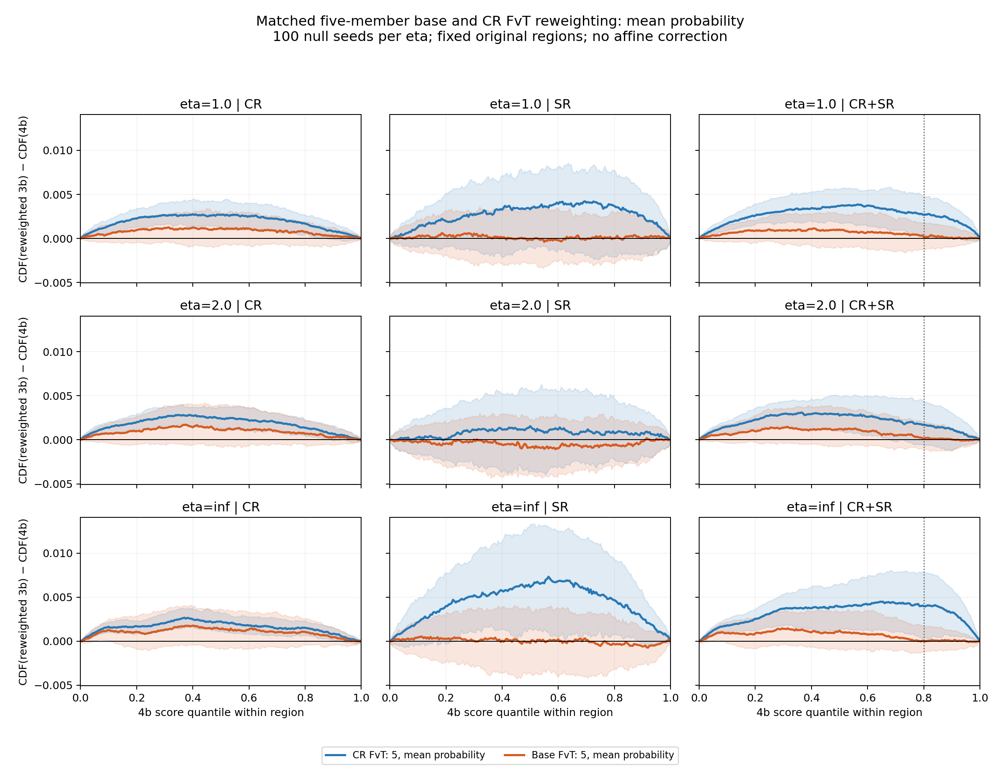
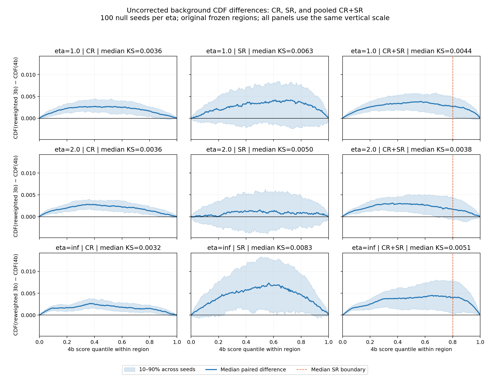
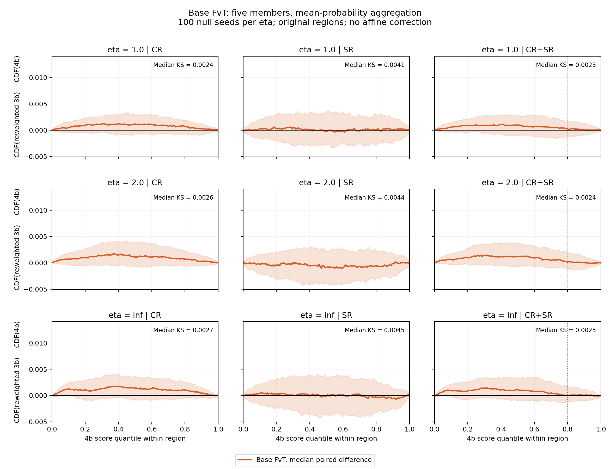
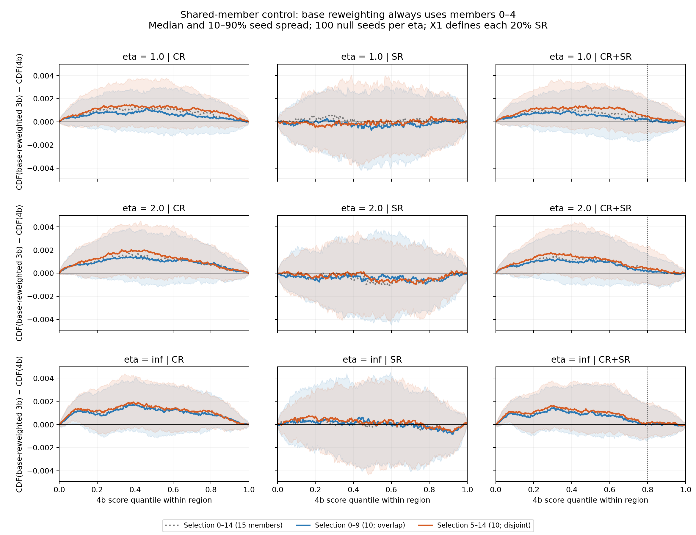
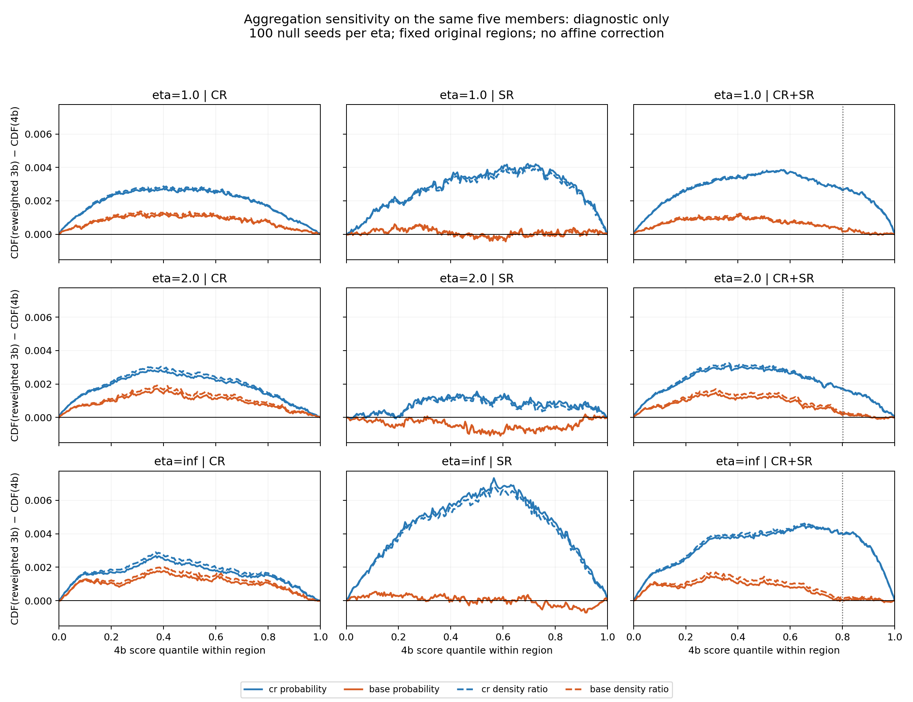
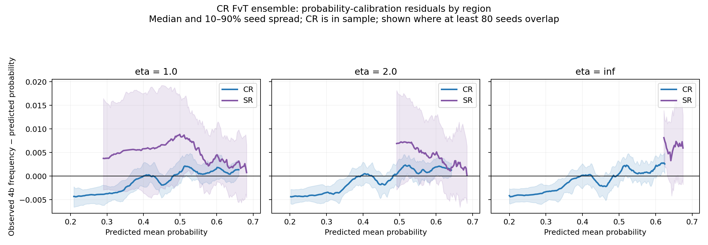
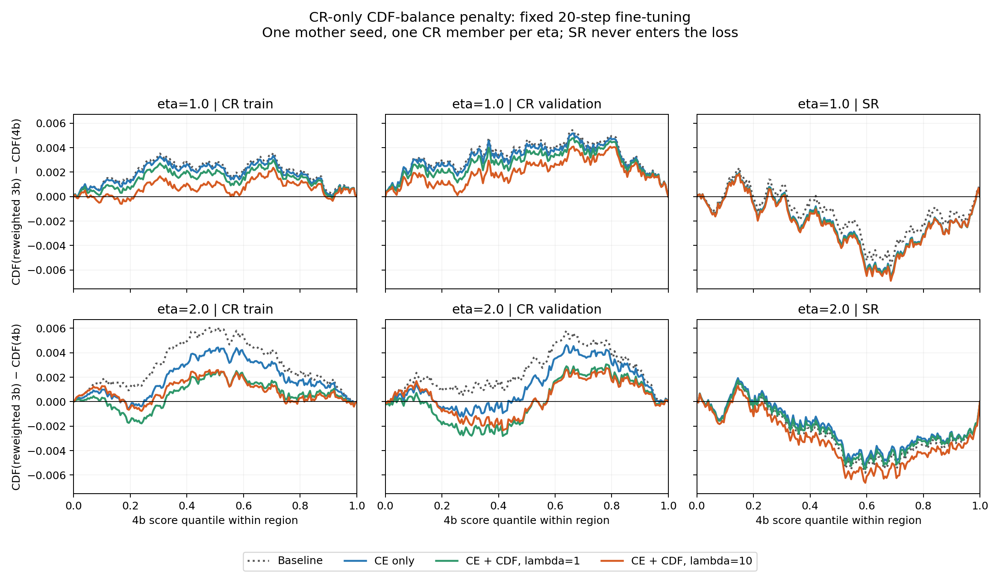
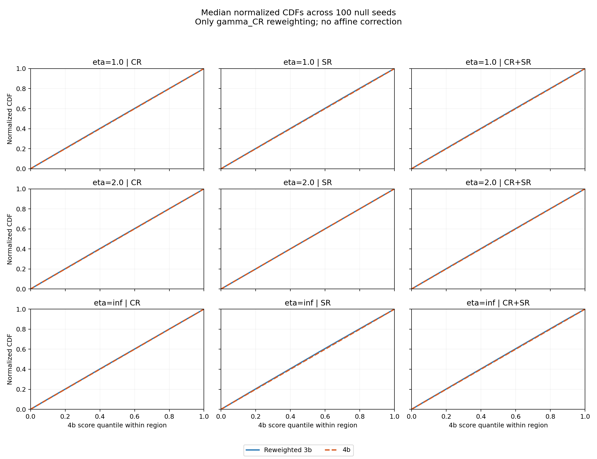

# Issue 14 diagnostic figures

[Investigation issue](https://github.com/soheunyi/SRFinder/issues/14).

Figures recorded on 2026-10-04. These are background-model diagnostics, not new hypothesis tests.

## Matched five-member base versus CR reweighting

Mean-probability aggregation for both, original 15-member selection, 100 null seeds per eta. Positive CDF residual means excess normalized low-score mass. Shading is 10–90% across seeds, not a confidence interval. CR includes training events for the CR learner.

## Original CR-trained background: CR, SR and pooled CDF residuals

Five CR members, mean probability, no affine correction. Each regional CDF is normalized within that region; the pooled CDF has one overall normalization.

## Base-only reweighting on the same regions

Base members 0–4, mean probability, evaluated on X2. The smaller positive CR residual and near-zero/slightly-negative median SR residual contrast with the CR-only learner.

## Selection-member overlap control

Reweighting stays fixed at base members 0–4. Selection uses 5–14 versus the equally sized 0–9 group; 0–14 is the original reference. All selection thresholds are defined on X1. Disjoint members still share training data.

## Aggregation sensitivity on the same five models

Solid lines use mean probability and dashed lines use mean density ratio. Curves are pointwise medians across 100 seeds; this is a diagnostic comparison, not a change to the primary aggregation rule.

## CR-learner probability-calibration residuals by region

This horizontal axis is predicted probability, not the separate test score. CR and SR show different conditional residual patterns. The CR observations include training events; curves are shown only where at least 80 seeds overlap.

## Exploratory CR CDF-penalty pilot, set aside

One mother seed and one CR member per eta, fixed 20-step fine-tuning. Both penalty strengths improve held-out CR KS but worsen SR KS relative to CE-only. These single-model SR residuals were already negative; this is not the 100-seed ensemble comparison. No production training or bootstrap changed.

## Normalized CDF overlays

Separate pointwise median CDFs over 100 seeds. Their difference need not equal the median paired residual shown in the primary diagnostics. The horizontal coordinate is the observed 4b score quantile within each region.

